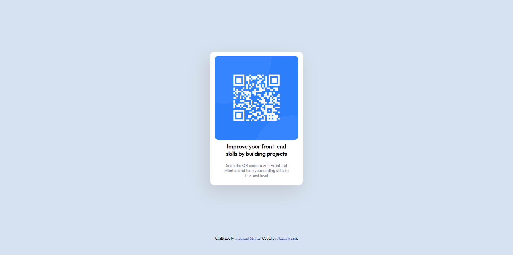

# Frontend Mentor - QR code component solution

This is a solution to the [QR code component challenge on Frontend Mentor](https://www.frontendmentor.io/challenges/qr-code-component-iux_sIO_H). Frontend Mentor challenges help you improve your coding skills by building realistic projects. 

## Table of contents

- [Overview](#overview)
  - [Screenshot](#screenshot)
  - [Links](#links)
- [My process](#my-process)
  - [Built with](#built-with)
  - [What I learned](#what-i-learned)
- [Author](#author)
- [Acknowledgments](#acknowledgments)


## Overview

### Screenshot




### Links

- Solution URL: [https://darknab.github.io/qr-code]


## My process

### Built with

- Semantic HTML5 markup
- CSS custom properties
- Flexbox

### What I learned

It was a good first challenge, the main problem I had was to keep the footer at the bottom of the screen!

that little negative margin-bottom is magic!

```css
body {
    margin: 0;
    background-color: hsl(212, 45%, 89%);
    margin-bottom: -5em;
}
```

## Author

- github - [Darknab](https://github.com/Darknab)
- Frontend Mentor - [@Darknab](https://www.frontendmentor.io/profile/Darknab)


## Acknowledgments

I've learnt front end web development fondations on the Odin project, these guys are awesome! the course is very well structureda d completely documented, All credit goes to them!
